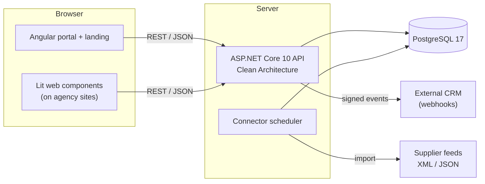

<div align="center">


<br/>

**A B2B platform that lets travel operators publish once and agencies distribute everywhere — through modern, themeable web components instead of dated iframes.**

[](https://github.com/odisea-network/odisea/actions/workflows/ci.yml)


[Overview](#overview) · [Features](#features) · [Architecture](#architecture) · [Quick start](#quick-start) · [Project layout](#project-layout) · [Testing](#testing)

</div>

---

## Overview

Travel offers are created by **tour operators** but sold by **travel agencies**, and between the two there is no shared layer that keeps content fresh *and* on‑brand. Agencies are left choosing between hand‑maintained listings that look right but go stale, and iframe embeds that stay current but feel like a foreign box on the page.

**Odisea** removes that compromise. A shared catalog of offers is curated by agencies into reusable **collections**, styled with a token‑based **theme**, and published as **embeddable web components** that render directly inside the agency's own site and inherit its look. Publish once, distribute everywhere, keep your brand.

The platform spans three surfaces, all sharing one design‑token system:

| Surface | What it is |
|---|---|
| **Landing** | Bilingual (BG/EN) marketing site with a live, themeable component demo |
| **Portal** | The B2B workspace: catalog, collection/publication composer, theme studio, supplier connectors, leads, webhooks |
| **Components** | Framework‑agnostic Lit web components that agencies embed and theme via CSS variables |

## Features

### 🗂 Catalog & distribution
- Shared offer catalog with manual entry and bulk CSV import
- **Collections** — saved, parameterized selections with nested `any`/`all` filter groups, pinned and excluded offers, per‑tenant slugs
- **Publications** — `Collection + Experience + Theme` with a stable public key and a cacheable manifest
- **Theme studio** — foundation / semantic / component design tokens, presets, draft vs published versions, CSS & JSON export
- **Embeddable components** that inherit the host site's look through `--odc-*` CSS variables (no iframe)

### 🔌 Supply & connectors
- Pluggable **connector engine** with a single contract and swappable adapters (Manual, JSON, XML)
- Background **scheduler** with freshness sweeps and idempotent imports
- Configurable **field mapping** so non‑canonical supplier feeds map onto the canonical offer
- Source lineage, import jobs and per‑connection health

### 🔐 Platform & security
- JWT auth with self‑service registration (a new user provisions their own agency/operator)
- Role policies (`PlatformAdmin` / `OperatorAdmin` / `AgencyAdmin` / `AgencyEditor`) and strict **multi‑tenant isolation**
- Embed security: scoped API keys, per‑publication allowed domains, HMAC‑signed webhooks, rate‑limited public endpoints
- Operator → agency **entitlements** with commission terms, a **leads** inbox, and basic analytics

## Architecture

The backend follows **Clean Architecture** with dependencies pointing inward; `Odisea.Domain` depends on nothing. The connector scheduler runs as a background service in the same process, and the Lit components are built once and served as static assets.



Layering: `Odisea.Domain` (entities, value objects, enums) → `Odisea.Application` (use cases, DTOs, `IAppDbContext`) → `Odisea.Infrastructure` (EF Core, migrations, connectors) → `Odisea.WebAPI` (MVC controllers, middleware). EF Core 10 with Npgsql maps everything to `snake_case`; enums persist as strings and flexible structures live in `jsonb`.

## Tech stack

| Layer | Technology |
|---|---|
| Backend | .NET 10, ASP.NET Core (MVC controllers), EF Core 10, Serilog, Swagger/OpenAPI |
| Database | PostgreSQL 17 (Npgsql, snake_case) |
| Portal & landing | Angular 21 (standalone components, signals, CSR) |
| Components | Lit 3 + TypeScript (Shadow DOM, themeable via CSS variables) |
| Infra | Docker Compose, GitHub Actions CI |

## Quick start

The whole stack runs with one command:

```bash
docker compose up -d --build
```

| Service | URL |
|---|---|
| Portal & landing | http://localhost:4200 |
| API | http://localhost:8080 |
| Swagger UI | http://localhost:8080/swagger |
| Health | http://localhost:8080/health |
| PostgreSQL | localhost:5433 |

Seeded demo accounts (development):

| Role | Email | Password |
|---|---|---|
| Agency | `blue@blue-horizon.com` | `Blue1234!` |
| Operator | `ops@sun-operators.com` | `Ops1234!` |
| Platform admin | `admin@odisea.net` | `Admin1234!` |

Stop with `docker compose down` (add `-v` to also wipe the database volume).

## Local development

Tighter feedback loops without containers:

```bash
# Backend  (needs .NET 10 SDK + Postgres on localhost:5433)
cd backend && dotnet run --project src/Odisea.WebAPI

# Portal  (Angular dev server, proxies /api)
cd frontend/portal && npm install && npx ng serve

# Components  (Lit library build)
cd frontend/components && npm install && npm run build
```

## Project layout

```
odisea/
├─ backend/
│  ├─ Odisea.sln
│  └─ src/
│     ├─ Odisea.Domain/          # entities, value objects, enums (no dependencies)
│     ├─ Odisea.Application/     # use cases, DTOs, IAppDbContext, business logic
│     ├─ Odisea.Infrastructure/  # EF Core, migrations, connectors, services
│     └─ Odisea.WebAPI/          # MVC controllers, middleware, Program.cs
│     tests/Odisea.UnitTests/    # xUnit unit & integration tests
├─ frontend/
│  ├─ portal/                    # Angular 21 portal + landing + auth (CSR)
│  └─ components/                # Lit 3 embeddable web components
├─ docs/                         # architecture notes, thesis, assets
└─ compose.yaml                  # db + api + portal
```

## Testing

```bash
dotnet test backend/Odisea.sln          # backend (xUnit, EF Core InMemory)
cd frontend/portal && npx ng test        # portal (Vitest)
```

Continuous integration (`.github/workflows/ci.yml`) runs three checks on every change: backend build + tests, Angular portal build, and the Lit components build.

## Status & roadmap

The platform covers the full path from offer ingestion to a branded embedded component, with a tenant‑safe portal and a working connector engine. Planned next: external (OAuth) sign‑in and password reset, real‑feed validation of the canonical offer schema, WordPress / Shopify distribution channels, SEO publishing, and a structured booking flow.

<div align="center"><sub>Built with .NET, Angular, Lit and PostgreSQL · одисея</sub></div>
