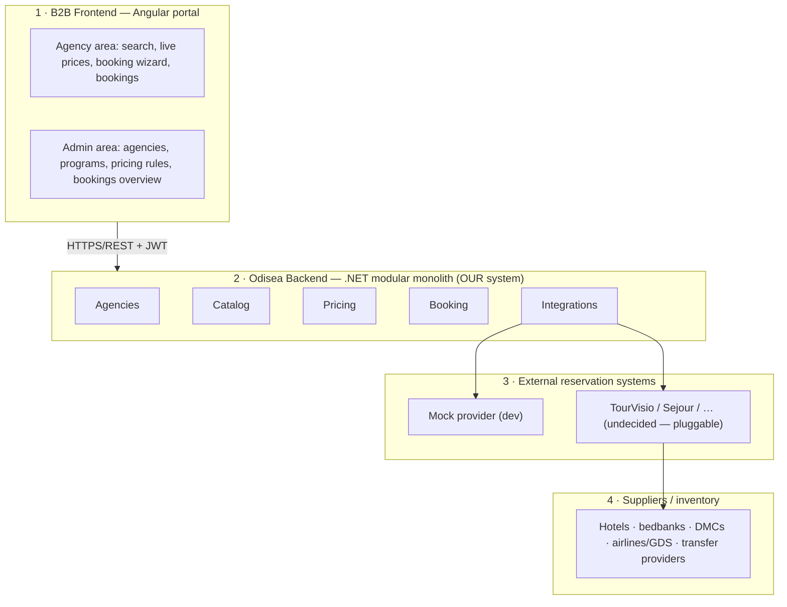

# Odisea v2 — Architecture Overview

> Living document. Update it in the same PR as any structural change (new module, new external system, changed boundaries). Last updated: 2026-10-09 (Phase 1).

## What Odisea is

A **B2B travel platform** for a tour operator (Paradise Travel). The operator composes its own packaged offers — accommodation + transport + transfer + insurance + extras — and distributes them to partner **travel agencies**, which search, see live-calculated prices, and book. Agencies sell the package as-is; the operator controls product, price and inventory sources.

## The four tiers



The key business flow (from the original whiteboard): agent searches a program → Catalog resolves allowed hotels → Integrations asks the provider for net prices → Pricing applies markup + commission + fees → agent sees final B2B price → RESERVE → re-check availability/price → booking confirmed and stored in our DB → voucher.

## Backend: modular monolith

One deployable (`Odisea.Api`), five modules, hard boundaries:

| Module | Owns | Depends on (PublicApi only) |
|---|---|---|
| **Agencies** | Identity & JWT auth, agencies, users, roles, credit limits, commission levels | — |
| **Catalog** | Destinations, hotels, programs, departures, allowed-hotel lists, **hotel/location mappings** (internal ↔ provider codes) | — |
| **Pricing** | Pricing rules (markup/fee/commission), exchange rates, the pure pricing engine | — |
| **Booking** | Bookings, passengers, status state machine, documents | Agencies (credit), Catalog (program refs), Pricing (breakdown), Integrations (provider ops) |
| **Integrations** | `IReservationProvider` contract, provider adapters (Mock now, real later), call logs | — |

**Boundary rules (enforced by an architecture test, all 20 pairs):**
- A module may reference another module **only through its `PublicApi` namespace**.
- Cross-module references are plain `Guid`s — no shared entities, no cross-schema FKs.
- Communication is direct interface injection. No MediatR, no event bus.
- Provider-specific state (`ProviderOfferToken`, external codes) never leaks past Integrations adapters.

**Module internal layout:** `PublicApi/` · `Domain/` · `Features/<feature>/` · `Infrastructure/` (DbContext + migrations) · `Controllers/` · `<Name>Module.cs` (DI extension). Namespace = folder.

## Data architecture

One PostgreSQL database, **one schema + one DbContext + one migrations history table per module**: `agencies`, `catalog`, `pricing`, `booking`, `integrations`. snake_case naming, enums stored as strings, version-7 GUIDs (time-ordered → append-only B-tree inserts). `SharedKernel` provides `Entity`, `Money`, `DateRange`, `Pax`, `IClock`, `ICurrentUser` — no EF, no HTTP.

## Auth & security model

- JWT (HS256, secret ≥ 256 bits, validated at startup; user-secrets in dev, env in prod). Claims: `sub`, `email`, `name`, `role`, `user_type` (`operator`|`agency`), `agency_id` (agency users only).
- **Deny by default:** a fallback authorization policy requires authentication on every endpoint; only `/api/v1/auth/login` and `/health` are `[AllowAnonymous]`.
- Policies: `Operator` (back-office) and `Agency` (portal) — defined in `Agencies.PublicApi.AuthPolicies`, consumed by all modules.
- Agency-scoped queries always filter by the **`agency_id` claim**, never by a client-supplied id.
- Login hardening: PBKDF2 hashing, 5-failure/15-min lockout, anti-enumeration (identical error + dummy hash). Full baseline and remaining checklist: issue #100.
- Supply chain: Dependabot (nuget + actions) and CodeQL run in CI.

## Provider abstraction (tier 3)

`Odisea.Modules.Integrations` defines the provider-neutral contract: search → re-price → book → cancel → status, plus a content-sync interface for hotel/location catalogs. Each external system is one adapter behind `IReservationProvider`; the **Mock adapter** is a first-class citizen (deterministic inventory, configurable availability failures and re-price drift) so every flow is testable before any real credentials exist. The real intermediary system (TourVisio vs Sejour, both SAN TSG) is deliberately undecided — the contract is indifferent. Hotel/location **mappings live in Catalog**; unmapped search results are dropped and logged, never shown half-mapped.

## Frontend (lands with #98)

One Angular 21 app (`frontend/portal`): standalone components, signals, strict templates. `core/` (auth, interceptor, guards) · `layout/` (agency + admin shells) · `features/{auth,agency,admin}`. Routes `/login`, `/agency/**`, `/admin/**`, lazy-loaded.

## Dev & verification workflow

```
docker compose up -d db        # Postgres 17 on host port 5433
dotnet run --project backend/src/Odisea.Api    # migrate + seed + listen on :8080
# Swagger UI: http://localhost:8080/swagger  (Authorize button takes the JWT)
# Dev login: admin@odisea.local / DevOnly-Odisea-Admin-2026!  (Development seeding only)
```

Every slice must pass: `dotnet build` (warnings = errors) · `dotnet test` · a live Swagger/API smoke against real Postgres. CI repeats build + test on every PR; CodeQL scans on every push to main.

## Document map

- [ROADMAP.md](ROADMAP.md) — phases, status, what's next
- Per-project READMEs — purpose and relations of each project (`backend/src/**/README.md`)
- Project board — https://github.com/orgs/odisea-network/projects/1 (source of truth for tasks)
- v1 (thesis project) — branch `archive/v1`, tag `v1.0-final`
